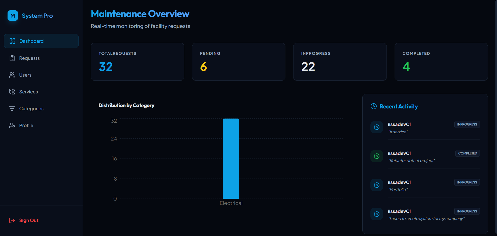

# Maintenance Task Tracker

Maintenance Task Tracker is a full-stack application for tracking maintenance requests and service tasks. It uses a clean layered .NET backend (Domain / Application / Infrastructure / Api) and a React + Vite TypeScript frontend that builds into the API's wwwroot for production.

## Architecture

- Api: ASP.NET Core Web API (net10.0) exposing REST endpoints, SignalR hub (/requestHub), Swagger UI, authentication (JWT) and static files (wwwroot).
- Application: Business logic, DTOs, services, and interfaces.
- Domain: Entities, enums and domain exceptions.
- Infrastructure: EF Core DbContext, repositories, Identity integration, migrations and configuration.
- ClientApp: React + Vite + TypeScript frontend (TailwindCSS, React Router, React Query, SignalR client).

## Prerequisites

- .NET 10 SDK
- Node.js (>=18) and npm
- SQL Server (or change connection string to your DB)

## Configuration

Main settings are in Api/appsettings.json (development values):
- ConnectionStrings:DefaultConnection — default: `Server=localhost\SQLEXPRESS;Database=MaintenanceTaskTracker;Trusted_Connection=True;TrustServerCertificate=True;`
- Jwt: SecretKey, Issuer, Audience, ExpiryMinutes

Adjust these before running in your environment.

## Local development

1. Backend
   - From repository root: `cd Api`
   - Restore and build: `dotnet restore && dotnet build`
   - (Optional) Apply migrations: `dotnet ef database update --project ../Infrastructure --startup-project .` or run the app and let it create DB per migrations.
   - Run: `dotnet run` (defaults to http://localhost:5143 and https://localhost:7114 per launchSettings)
   - Swagger UI available at `http://localhost:5143/swagger` (in Development).

2. Frontend
   - From repository root: `cd ClientApp`
   - Install: `npm install`
   - Start dev server: `npm run dev` (Vite runs on http://localhost:5173)
   - The dev server proxies `/api` to the backend (http://localhost:5143) per vite.config.ts.

3. Full-stack dev flow
   - Start the API (dotnet run)
   - Start the frontend (npm run dev)
   - Use the app at http://localhost:5173. The frontend build output for production writes to `Api/wwwroot` (see vite.config.ts).

## Building for production

- From ClientApp: `npm run build` — files are emitted to `Api/wwwroot`.
- From Api: publish the API as usual (`dotnet publish -c Release`) and host the published output.

## Database & Migrations

- Migrations live in Infrastructure/Migrations. The DbContext uses SQL Server by default; change the connection string in Api/appsettings.json to point to your DB.
- Seed logic runs at startup (Program.cs calls SeedAsync) — check the Infrastructure project for seed implementation.

## Real-time notifications

- SignalR hub is available at `/requestHub`. Frontend uses `@microsoft/signalr` to connect; the backend accepts access_token query param for websocket auth.

## Notes

- CORS allows `http://localhost:5173` (dev) and a configured ngrok domain. Update CORS origins in Api/Program.cs if needed.
- Authentication uses JWT. Update Jwt values in appsettings for production and keep secrets secure (do not commit production secrets).
